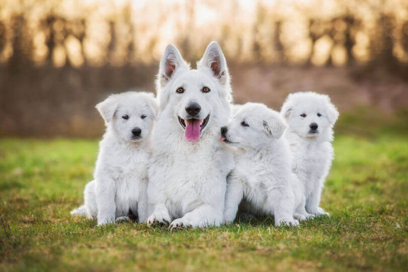

# 🐶 DogsGFT 🐾



## 📌 Descrição do Projeto

DogsGFT é uma API RESTful desenvolvida em Spring Boot que interage com a API externa **The Dog API** para buscar e armazenar informações sobre raças de cachorros. A aplicação permite realizar operações CRUD (Create, Read, Update, Delete) sobre dados de cachorros e buscar imagens e raças diretamente da API externa. 🐕💻

## 🚀 Tecnologias Utilizadas

- **☕ Java 21** - Linguagem de programação principal
- **🌱 Spring Boot 3.4.2** - Framework para construção da API
- **🔨 Maven** - Ferramenta de automação de build e gerenciamento de dependências
- **🗄️ Jakarta Persistence (JPA)** - Mapeamento objeto-relacional (ORM)
- **📌 Lombok** - Redução de boilerplate nas classes de modelo
- **📦 Jackson** - Serialização e desserialização de JSON
- **📜 Swagger** - Documentação interativa da API
- **🐬 MySQL** - Banco de dados para armazenamento
- **🧪 Mockito** - Framework para testes unitários
- **🔐 Spring Security** - Segurança da aplicação
- **🔑 JWT** - Autenticação baseada em token

## 🎯 Objetivo do Projeto

O projeto visa fornecer uma API para:
1. 🏗️ Gerenciar um banco de dados de cachorros via operações CRUD.
2. 🔍 Integrar-se à API externa **The Dog API** para obter informações detalhadas sobre raças.
3. 🎯 Permitir buscas de cachorros baseadas em raça e nome.
4. 🖼️ Disponibilizar imagens de cachorros para os usuários.
5. 🔐 Gerar e validar tokens JWT para autenticação.

## ⚙️ Como Executar o Projeto

### 1️⃣ Clonar o Repositório
```sh
 git clone https://git.gft.com/glir/api_dogs
 cd api_dogs
```

### 2️⃣ Configurar o Banco de Dados MySQL 🛢️
Altere o arquivo `src/main/resources/application.properties` conforme sua configuração do MySQL:
```properties
spring.datasource.url=jdbc:mysql://localhost:3306/dogs_db
spring.datasource.username=seu_usuario
spring.datasource.password=sua_senha
```

### 3️⃣ Configurar a API Key da **The Dog API** 🔑
Adicione sua chave de acesso como uma variável de ambiente:
```sh
export THEDOGAPI_APIKEY="sua-api-key"
```

### 4️⃣ Construir o Projeto 🏗️
```sh
mvn clean install
```

### 5️⃣ Executar a Aplicação ▶️
```sh
mvn spring-boot:run
```

### 6️⃣ Acessar a Documentação no Swagger 📖
```sh
http://localhost:8080/swagger-ui.html
```

## 📡 Endpoints Disponíveis

### 🐾 Gerenciamento de Cachorros

| ⚡ Método | 🔗 Endpoint | 📝 Descrição |
|---------|----------|-------------|
| **POST** | `/api/dogs` | Criar um novo cachorro 🐕|
| **GET** | `/api/dogs/{id}` | Buscar cachorro por ID 🔍|
| **GET** | `/api/dogs` | Listar todos os cachorros 📜|
| **PUT** | `/api/dogs/{id}` | Atualizar um cachorro 🔄|
| **DELETE** | `/api/dogs/{id}` | Remover um cachorro ❌|

### 🔍 Busca de Cachorros

| ⚡ Método | 🔗 Endpoint | 📝 Descrição |
|---------|----------|-------------|
| **GET** | `/api/dogs/breed/{breed}` | Buscar cachorros por raça 🐩|
| **GET** | `/api/dogs/name/{name}` | Buscar cachorros por nome 🏷️|
| **GET** | `/api/dogs/breed-and-name?breed={breed}&name={name}` | Buscar cachorros por raça e nome 🧐|
| **GET** | `/api/dogs/with-image` | Listar cachorros com imagens 🖼️|
| **GET** | `/api/dogs/name-contains/{keyword}` | Buscar cachorros cujo nome contém uma palavra-chave 🔠|
| **GET** | `/api/dogs/breed-contains/{keyword}` | Buscar cachorros cuja raça contém uma palavra-chave 🔡|

### 🌍 Integração com The Dog API

| ⚡ Método | 🔗 Endpoint | 📝 Descrição |
|---------|----------|-------------|
| **GET** | `/api/dogs/fetch-all-breeds` | Buscar todas as raças 🐶|
| **GET** | `/api/dogs/fetch-images/{breed}/{limit}` | Buscar imagens por raça 🖼️|
| **GET** | `/api/dogs/fetch-breeds?store=\{true\|false\}` | | Buscar raças e opcionalmente armazenar no banco 🗄️|


### 🔐 Autenticação

| ⚡ Método | 🔗 Endpoint                                    | 📝 Descrição |
|----------|------------------------------------------------|-------------|
| **POST** | `/authenticate`                                | Gerar token JWT 🔑|


## 🧪 Testes

Para rodar os testes unitários:
```sh
mvn test
```

## 🤝 Contribuição

1. 🍴 Fork este repositório.
2. 🏗️ Crie um branch: `git checkout -b feature/nova-feature`
3. 📝 Commit suas alterações: `git commit -m "Adicionando nova funcionalidade"`
4. 📤 Envie para o branch principal: `git push origin feature/nova-feature`
5. 🔀 Abra um Pull Request.

## Desenvolvedora

👩‍💻 **Grazielle Ferreira**

